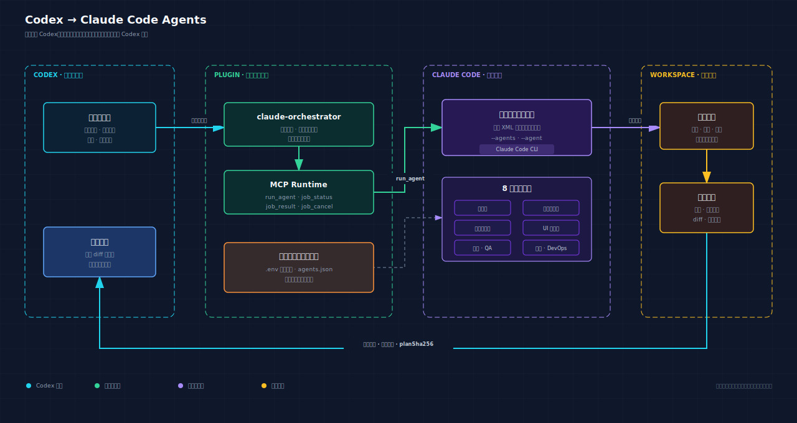

# Multi-CLI Agents for Codex

[English](./README.md) | [简体中文](./README.zh-CN.md)

一个本地 Codex 插件，用于把已经批准的实施计划委派给不同角色的 Claude Code CLI 智能体。Codex 负责规划、范围控制和最终审查，Claude Code 在目标仓库中执行委派任务。



## 功能特性

- 通过 `--agents` 和 `--agent` 使用 Claude Code 原生自定义智能体。
- 内置 8 个软件交付角色，每个角色拥有独立提示词和质量门禁。
- 支持按智能体配置模型、思考强度、权限、超时、预算、API 网关和凭据。
- 支持前台执行、后台任务、取消、结果持久化和会话恢复。
- 提供本地可视化指挥中心：智能体配置、Codex 插件安装、任务发起和流式会话监控均可在浏览器完成。
- 配置、任务元数据、结果和脱敏事件流统一存储在 SQLite（WAL）数据库中。
- UI、前端和 QA 智能体支持真实浏览器验证。
- 支持仓库原生 Playwright/Cypress、Claude in Chrome 和浏览器 MCP。
- 提供浏览器能力预检、证据门禁和可执行的安装提示。
- 默认只返回紧凑进度和结果，避免把原始事件流写入 Codex 上下文。
- 无 npm 运行时依赖。

## 内置智能体

| 智能体 | ID | 主要职责 | 默认权限 |
|---|---|---|---|
| 架构师 | `architect` | 系统边界、质量属性、ADR 和技术风险 | `plan` |
| 后端工程师 | `backend-engineer` | API、领域模型、一致性、可靠性和可观测性 | `auto` |
| 前端工程师 | `frontend-engineer` | 组件、状态、可访问性、性能和浏览器行为 | `auto` |
| UI 设计师 | `ui-designer` | 信息层级、设计系统、交互状态和视觉质量 | `auto` |
| 全栈工程师 | `fullstack-engineer` | 跨层纵向切片和端到端集成 | `auto` |
| 测试工程师 | `qa-engineer` | 风险驱动测试、回归、浏览器冒烟和 E2E 门禁 | `auto` |
| 安全工程师 | `security-engineer` | 威胁建模、授权、数据保护和供应链审查 | `plan` |
| DevOps/SRE 工程师 | `devops-engineer` | CI/CD、基础设施、可观测性、SLO、发布和回滚 | `auto` |

## 环境要求

- Node.js 22.5 或更高版本。
- 本机可以执行 `claude` 命令。
- 已登录 Claude Code，或已配置兼容的 API 网关和凭据。
- Codex 客户端支持本地插件和 stdio MCP Server。

## 安装

### 从 GitHub 安装

```bash
codex plugin marketplace add manzuxs/codex-plugin-claude-agents
codex plugin add multi-cli-agents@local-multi-cli-agents
```

也可以使用完整 Git URL：

```bash
codex plugin marketplace add https://github.com/manzuxs/codex-plugin-claude-agents.git
codex plugin add multi-cli-agents@local-multi-cli-agents
```

### 从本地仓库安装

```bash
git clone https://github.com/manzuxs/codex-plugin-claude-agents.git
cd codex-plugin-claude-agents
codex plugin marketplace add "$(pwd)"
codex plugin add multi-cli-agents@local-multi-cli-agents
```

安装后请新建 Codex 任务，使插件技能和 MCP 工具完成加载。如果 Codex 仍引用旧的插件缓存路径，请完全退出桌面应用，重新启动后再新建任务。

### 更新

```bash
codex plugin marketplace upgrade local-multi-cli-agents
codex plugin add multi-cli-agents@local-multi-cli-agents
```

## 配置

建议把长期用户配置保存在插件缓存目录之外：

```bash
mkdir -p ~/.config/multi-cli-agents
cp plugins/claude-code-agents/.env.example ~/.config/claude-code-agents/.env
chmod 600 ~/.config/multi-cli-agents/.env
```

最小配置：

```dotenv
CLAUDE_DEFAULT_MODEL=sonnet
CLAUDE_DEFAULT_EFFORT=high
CLAUDE_DEFAULT_PERMISSION_MODE=auto
CLAUDE_DEFAULT_TIMEOUT_MS=1800000
CLAUDE_DEFAULT_OUTPUT_FORMAT=json
```

每个智能体都可以通过自身前缀覆盖默认配置：

```dotenv
BACKEND_ENGINEER_MODEL=<your-model>
BACKEND_ENGINEER_EFFORT=high
BACKEND_ENGINEER_PERMISSION_MODE=auto
BACKEND_ENGINEER_GATEWAY_URL=https://your-api-gateway.example.com/v1
BACKEND_ENGINEER_API_KEY=replace-me
BACKEND_ENGINEER_API_KEY_KIND=auth_token
```

支持的思考强度：

```text
low | medium | high | xhigh | max
```

支持的权限模式：

```text
default | acceptEdits | auto | bypassPermissions | dontAsk | plan
```

插件不会强制使用 `bypassPermissions`。只有在明确接受其安全影响时，才为相应智能体配置该模式。

配置优先级从低到高：

1. 插件 `.env`。
2. `~/.config/claude-code-agents/.env`。
3. `<project>/.claude-agents.env`。
4. Codex 进程继承的环境变量。
5. 单次 `run_agent` 调用的非秘密覆盖字段。

可以通过 `CLAUDE_AGENTS_CONFIG_FILE` 指定其他用户配置文件。

### API 网关和凭据

```dotenv
CLAUDE_DEFAULT_GATEWAY_URL=https://your-api-gateway.example.com/v1
CLAUDE_DEFAULT_API_KEY=replace-me
CLAUDE_DEFAULT_API_KEY_KIND=auth_token
```

- `auth_token` 映射到 `ANTHROPIC_AUTH_TOKEN`。
- `api_key` 映射到 `ANTHROPIC_API_KEY`。
- 网关地址映射到 `ANTHROPIC_BASE_URL`。

凭据只注入 Claude 子进程环境，不会进入 CLI 参数、委派 XML、MCP 返回值或持久化的后台任务请求。

## 使用方式

### 可视化指挥中心

在仓库根目录启动本地控制台：

```bash
npm run dashboard
```

页面会自动检测 Codex 插件是否已安装。未安装时，点击“开始安装”即可注册本地 marketplace 并安装 `multi-cli-agents`；完成后重启 Codex，新建任务即可加载插件。安装后的 Codex 会话也可以直接调用 `open_dashboard` 工具唤起页面。

控制台中的“配置中心”把智能体运行配置写入 `~/.codex/multi-cli-agents`；如果检测到旧的 `~/.codex/claude-code-agents`，会继续复用旧数据。凭据只显示“已配置”状态，绝不返回明文。当前版本要求 Node.js 22.5 或更高版本，以使用原生 `node:sqlite`；数据库启用 WAL，MCP 主进程、后台 worker 与浏览器控制台可以并发访问。

先让 Codex 阅读仓库并生成具体计划：

```text
阅读当前仓库，为这个需求输出可执行的实施计划，暂时不要修改文件。
计划必须包含真实文件范围、接口或数据契约、实施步骤、风险、验证命令和验收标准。
```

确认计划后委派给专业智能体：

```text
按已批准计划直接实施，不要重新规划。启用后端工程师智能体执行。
完成后检查实际 diff、验证证据和未完成事项。
```

其他示例：

```text
按已批准计划，启用全栈工程师智能体完成纵向切片。
```

```text
按已批准计划，启用 UI 设计师智能体实现并完成真实页面视觉验收。
```

```text
启用架构师智能体评审已批准方案，只报告架构风险和 ADR，不修改文件。
```

## 浏览器验证

`ui-designer`、`frontend-engineer` 和 `qa-engineer` 可以启用浏览器模式，不同角色使用不同的完成门禁：

| 智能体 | 验证目的 | 推荐后端 | 必需证据 |
|---|---|---|---|
| `ui-designer` | 视觉验收 | 浏览器 MCP 或 Chrome | 真实页面、目标视口、交互状态和截图 |
| `frontend-engineer` | 实现自测 | 仓库 Playwright/Cypress | 受影响用户路径、响应式与交互行为、控制台状态和可复现证据 |
| `qa-engineer` | 独立冒烟、回归或 E2E | 仓库 Playwright/Cypress 或 MCP | 用户路径断言、命令或工具动作和证据位置 |

支持的浏览器模式：

| 模式 | 行为 |
|---|---|
| `none` | 不加载浏览器能力。 |
| `repository` | 使用目标仓库中现有的 Playwright 或 Cypress。 |
| `chrome` | 启用 Claude in Chrome 并复用现有浏览器会话，需要直接 Anthropic 身份认证。 |
| `mcp` | 通过 `--mcp-config` 和 `--strict-mcp-config` 加载受信任的浏览器 MCP 配置。 |

MCP profile 配置示例：

```dotenv
UI_DESIGNER_BROWSER_MCP_CONFIGS_JSON={"playwright":"/absolute/path/to/playwright-mcp.json"}
FRONTEND_ENGINEER_BROWSER_MCP_CONFIGS_JSON={"playwright":"/absolute/path/to/playwright-mcp.json"}
QA_ENGINEER_BROWSER_MCP_CONFIGS_JSON={"playwright":"/absolute/path/to/playwright-mcp.json"}
```

委派示例：

```json
{
  "agent": "qa-engineer",
  "task": "运行关键用户路径的真实浏览器冒烟测试",
  "plan": "<已批准的 Codex 计划>",
  "acceptanceCriteria": "在真实浏览器完成用户路径、断言结果并保存证据",
  "browserMode": "repository",
  "cwd": "/absolute/path/to/project"
}
```

插件会检查仓库依赖、验证 MCP 配置、读取 Claude `system/init` 能力清单，并要求观察到真实浏览器执行。门禁失败时返回 `blocked` 和 `installationHint`。插件不会自动安装依赖，也不会静默使用 Codex 浏览器自动化替代对应智能体。

## MCP 工具

| 工具 | 用途 |
|---|---|
| `list_agents` | 列出可用智能体及其非秘密运行配置。 |
| `run_agent` | 把已批准计划委派给一个专业智能体。 |
| `job_status` | 只读返回后台任务的紧凑进度。 |
| `job_wait` | 在 MCP 服务端等待后台任务终态并返回一次紧凑结果。 |
| `job_result` | 返回持久化的终态结果。 |
| `job_cancel` | 取消正在运行的后台任务。 |

`run_agent` 必须提供 `agent`、`task` 和 `plan`。常用可选字段包括：

```text
acceptanceCriteria, context, cwd, background, persistOnDisconnect,
leaseTimeoutMs, dryRun, resume, sessionId, model, effort,
permissionMode, timeoutMs, maxBudgetUsd, allowedTools, disallowedTools,
browserMode, browserMcpProfile
```

`resume` 和 `sessionId` 不能同时使用。

### 后台任务

顺序任务默认使用 `background=false`，MCP 请求保持挂起，Agent 完成后只恢复一次 Codex 回合。需要并行或显式进度观察时使用 `background=true`；调用返回 Job ID 后，Codex 只调用一次 `job_wait`，由 MCP 服务端等待终态并返回紧凑结果。`job_status` 只读，后台 Worker 根据活动自行续租，不依赖 Codex 轮询。

只有需要先返回 Job ID、并行运行或显式查看进度时，才使用 `background=true`。只有用户明确要求任务脱离 Codex 会话继续运行时，才使用 `persistOnDisconnect=true`。

任务数据默认写入 Codex 提供的 `PLUGIN_DATA` 目录。直接执行时回退到 `~/.codex/multi-cli-agents`，并兼容旧目录。历史保留是显式操作：`node plugins/claude-code-agents/server/cli.mjs cleanup --before ISO_DATE` 只删除过期终态任务及其事件，不自动运行，也不会删除活动任务。

## 诊断

```bash
npm test
npm run check
npm run coverage
npm run doctor
npm run list-agents
npm run dry-run
```

直接运行 CLI dry run：

```bash
node plugins/claude-code-agents/server/cli.mjs run \
  --agent backend-engineer \
  --task "实现用户查询接口" \
  --plan @/tmp/codex-plan.md \
  --cwd /path/to/project \
  --dry-run
```

只有确实要启动本机 Claude Code 进程时，才移除 `--dry-run`。

## 安全模型

- Codex 负责规划、范围控制和最终审查。
- Claude 专业智能体接收已批准计划和仓库上下文并执行任务。
- 子进程使用参数数组和 `shell: false`。
- 密钥只保留在子进程环境中，并从存储或返回的数据中清除。
- 浏览器 MCP 调用方只能选择受信任的 profile 名称，不能传入任意配置路径。
- 未观察到真实浏览器执行时，浏览器验证不能通过。
- 后台任务默认与 Codex 会话绑定，所有者断开后自动取消。
- `planSha256` 用于标识委派计划，不表示实现已经通过审查。

## 仓库结构

```text
.
├── .agents/plugins/marketplace.json
├── plugins/claude-code-agents/
│   ├── .codex-plugin/plugin.json
│   ├── .mcp.json
│   ├── .env.example
│   ├── agents/
│   ├── server/
│   ├── skills/
│   └── scripts/
├── diagram/
├── tests/
├── QUICKSTART.md
└── VALIDATION.md
```

## 许可证

MIT

## 多 CLI Runner

执行链现在按“角色 + Runner”编排。省略 `runner` 的旧调用仍然使用配置的默认 Runner；显式传入 `runner` 可以选择 `claude`、`codex`、`grok` 或 `agy`。`list_runners` 会返回实际 CLI 可用状态和能力声明。Claude 使用原生 `--agents`，Codex 调用 `codex exec --json`，Grok 使用 headless single-turn JSON/JSONL，Antigravity 使用 `agy --print` 文本输出。

Runner 配置优先级为：Runner 默认值、角色默认 Runner、角色×Runner 配置、进程环境、单次非秘密覆盖。现有 `CLAUDE_DEFAULT_*` 与 `<ROLE>_*` 变量继续兼容。不同 Runner 的模型、effort、权限、输出和会话能力由各自 adapter 校验；不支持的请求会返回明确错误，不会静默降级。

Codex 所需凭据（若本机 CLI 需要）只进入子进程环境。native CLI 参数仅由受信 adapter 和配置生成，MCP 调用方不能注入任意 native options。
